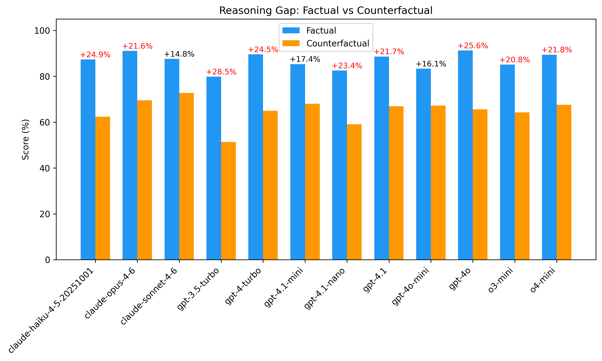
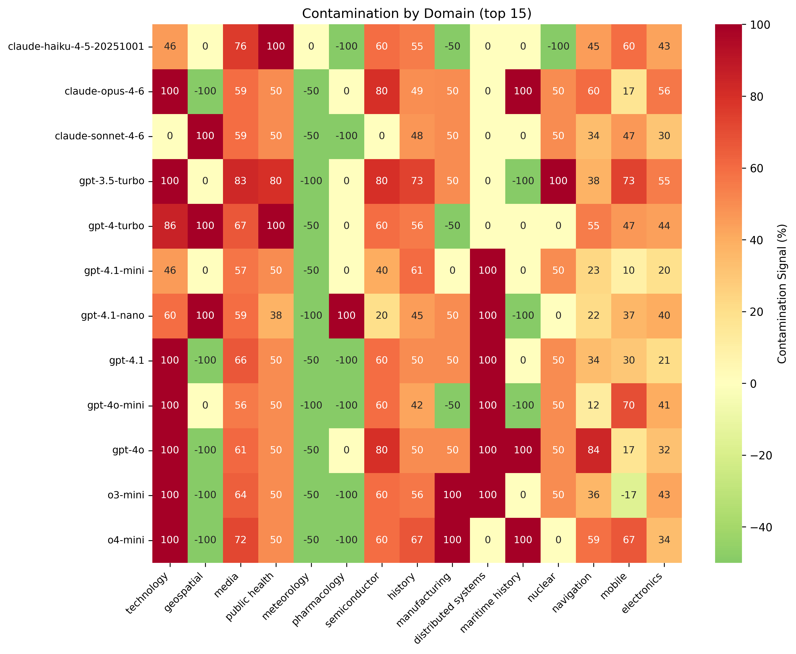
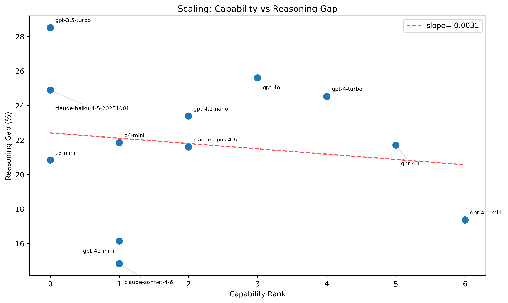

# EPOCH Benchmark

**Evaluating Progress Origins in Causal History**

A benchmark for testing LLM causal reasoning about technology dependencies. Every question has a factual + counterfactual twin — the delta between them measures how much a model relies on memorization vs. genuine causal reasoning.

## Leaderboard

340 questions (170 pairs), 12 models. Ranked by EPOCH Score (0.4 × Factual + 0.6 × Counterfactual).

| # | Model | EPOCH | Factual | CF | Gap |
|---|-------|------:|--------:|---:|----:|
| 1 | **claude-sonnet-4-6** | **78.7%** | 87.6% | **72.7%** | **14.8%** |
| 2 | claude-opus-4-6 | 78.1% | **91.1%** | 69.5% | 21.6% |
| 3 | o4-mini | 76.3% | 89.4% | 67.6% | 21.8% |
| 4 | gpt-4o | 75.9% | 91.2% | 65.6% | 25.6% |
| 5 | gpt-4.1 | 75.6% | 88.6% | 66.9% | 21.7% |
| 6 | gpt-4.1-mini | 74.9% | 85.3% | 68.0% | 17.4% |
| 7 | gpt-4-turbo | 74.8% | 89.5% | 65.0% | 24.5% |
| 8 | gpt-4o-mini | 73.6% | 83.3% | 67.2% | 16.1% |
| 9 | o3-mini | 72.6% | 85.1% | 64.3% | 20.8% |
| 10 | claude-haiku-4.5 | 72.4% | 87.3% | 62.4% | 24.9% |
| 11 | gpt-4.1-nano | 68.5% | 82.5% | 59.1% | 23.4% |
| 12 | gpt-3.5-turbo | 62.7% | 79.8% | 51.3% | 28.5% |

### Key Findings

- **Factual score != reasoning ability.** GPT-4o and Opus have the highest factual scores (~91%) but rank below Sonnet overall — Sonnet wins by having the best counterfactual reasoning (72.7%) and smallest gap (14.8%).
- **Scaling does not significantly close the gap** (slope=-0.003, p=0.63). Bigger models memorize more but don't proportionally reason better.
- **CHAIN, GATE, and BRIDGE show genuine counterfactual reasoning.** Models massively outperform a "copy factual answer" baseline on these types (+49%, +56%, +62% margins). Only RIPPLE CF scores remain below the baseline — models list factual-world answers instead of reasoning about the alternative.
- **Mini models punch above their weight.** Sonnet (14.8%), gpt-4o-mini (16.1%), and gpt-4.1-mini (17.4%) have the smallest gaps — less memorization means more genuine reasoning.



## Question Types

| Type | Task | Scoring |
|------|------|---------|
| **CHAIN** | Order N technologies by dependency | Kendall's tau |
| **GATE** | Is X achievable given constraints? (Yes/No) | Accuracy |
| **RIPPLE** | If X never existed, what breaks? | F1 |
| **BRIDGE** | Missing step A → ? → C (multiple choice) | Accuracy |

## Scoring

- **EPOCH Score** = 0.4 × Factual + 0.6 × Counterfactual (0–100)
- **Reasoning Gap** = Factual − Counterfactual

A high Reasoning Gap means the model scores well on real-world facts but poorly on counterfactuals — suggesting memorization over causal understanding. The EPOCH Score weights counterfactual performance higher because it better reflects genuine reasoning ability.

### Scoring Notes and Known Limitations

**Copy-factual baseline:** We compare model CF scores against a naive strategy that copies the factual answer to CF questions. Models genuinely reason on CHAIN (+49%), GATE (+56%), and BRIDGE (+62%). Only RIPPLE CF doesn't beat the baseline — models over-predict by listing factual-world answers instead of reasoning about the counterfactual scenario.

**RIPPLE F1 asymmetry:** CF RIPPLE answers average 1.4 items vs 3.5 for factual. Models over-predict (listing factual-world answers instead of reasoning about the alternative), resulting in low precision.

**GATE flip pattern:** 68% of GATE pairs flip the answer between variants (16 of 50 pairs are non-flipping). Models show nuanced patterns — 7 of 12 score better on CF GATE, suggesting the alternative-world framing genuinely aids prerequisite reasoning.

## Setup

```bash
pip install -e .
```

Requires Python 3.10+. Set your API key:

```bash
export ANTHROPIC_API_KEY=sk-...
# or
export OPENAI_API_KEY=sk-...
```

## Usage

```bash
# Run full benchmark
epoch-bench run --provider anthropic --model claude-sonnet-4-6

# Run specific question types
epoch-bench run --provider openai --model gpt-4o --types CHAIN --types GATE

# Save results to file
epoch-bench run --provider anthropic --model claude-sonnet-4-6 --output results.json

# Compare two models
epoch-bench compare results_a.json results_b.json

# Statistical analysis
epoch-bench analyze results_a.json results_b.json --output analysis.json

# Generate leaderboard
epoch-bench leaderboard results_a.json results_b.json

# Generate figures
epoch-bench figures results/*.json --output-dir figures/
```

## Dataset

340 hand-crafted questions across 4 JSONL files in `epoch_bench/data/`:

- `chain.jsonl` — 40 factual/counterfactual pairs (80 questions, 20 with unique CF item sets)
- `gate.jsonl` — 50 pairs (100 questions, 14 non-flipping pairs)
- `ripple.jsonl` — 40 pairs (80 questions)
- `bridge.jsonl` — 40 pairs (80 questions)

Questions are split into **open** (260, published) and **closed** (80, held back) test sets to prevent future training contamination. Use `--split open` to run only the public set.

## Novel Features

### Technology Dependency Graph

Extracts a directed acyclic graph (~330 nodes, ~287 edges) from the 320 hand-crafted questions, then procedurally generates unlimited new factual/counterfactual question pairs from it.

```bash
# Build the graph
epoch-bench graph --rebuild --stats

# Generate new question pairs
epoch-bench generate --n-per-type 10 --pairs --output generated.jsonl --seed 42
```

### Contamination Analysis

Reframes the factual/counterfactual gap as a training data contamination detector. Counterfactual questions are structurally immune to contamination — if a model scores much higher on factual than counterfactual variants, it's likely memorizing training data rather than reasoning.

```bash
epoch-bench contamination results/*.json --threshold 0.3
```



### Scaling Analysis

Analyzes whether increased model capability closes the reasoning gap. Groups models by family, regresses gap vs. capability rank, and classifies per-family trends.

```bash
epoch-bench scaling results/*.json
```



## Project Structure

```
epoch_bench/
├── cli.py              # CLI entry point (13 commands)
├── schema.py           # Pydantic data models
├── evaluate.py         # Scoring logic (Kendall's tau, accuracy, F1)
├── analysis.py         # Statistical analysis (gap significance, correlations)
├── graph.py            # Dependency graph + procedural question generator
├── contamination.py    # Contamination detection via F/CF gap
├── scaling.py          # Scaling analysis (gap vs capability)
├── figures.py          # Publication-quality matplotlib figures
├── runner.py           # Benchmark orchestration
├── report.py           # Rich console output
├── prompts.py          # Structured prompt templates
├── suite.py            # Multi-model suite runner
├── leaderboard.py      # Leaderboard generation
├── validation.py       # Expert review export/import
├── human_baseline.py   # Interactive human baseline
├── models/
│   ├── base.py               # Abstract ModelProvider
│   ├── anthropic_provider.py
│   ├── openai_provider.py
│   ├── gemini_provider.py
│   └── deepseek_provider.py
└── data/
    ├── chain.jsonl
    ├── gate.jsonl
    ├── ripple.jsonl
    ├── bridge.jsonl
    └── tech_aliases.json  # Technology name normalization
```

## License

MIT
